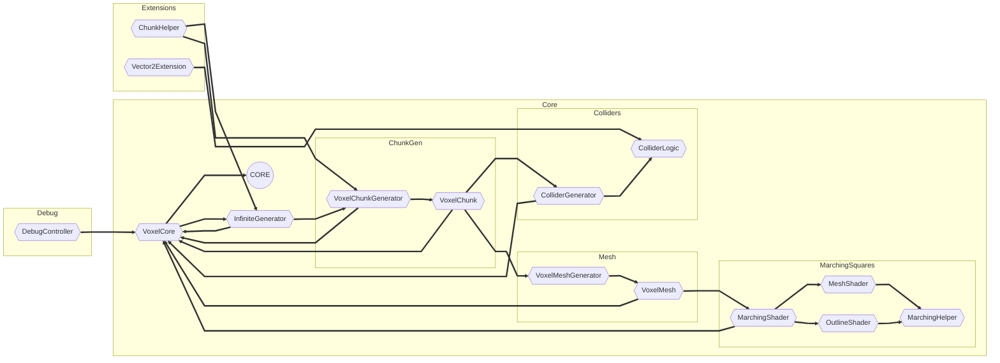

```mermaid
graph LR;
  %% Config
  linkStyle default interpolate linear;

  %% Core Utilities
  subgraph Core
    CORE((CORE));
    VoxelCore{{VoxelCore}};
    InfiniteGenerator{{InfiniteGenerator}};

    subgraph ChunkGen
      VoxelChunkGenerator{{VoxelChunkGenerator}};
      VoxelChunk{{VoxelChunk}};
    end

    subgraph Colliders
      ColliderGenerator{{ColliderGenerator}};
      ColliderLogic{{ColliderLogic}};
    end

    subgraph Mesh
      VoxelMeshGenerator{{VoxelMeshGenerator}};
      VoxelMesh{{VoxelMesh}};
    end

    subgraph MarchingSquares
      MarchingShader{{MarchingShader}};
      MeshShader{{MeshShader}};
      OutlineShader{{OutlineShader}};
      MarchingHelper{{MarchingHelper}};
    end
  end

  %% Debug
  subgraph Debug
    DebugController{{DebugController}};
  end

  %% Extensions
  subgraph Extensions
    ChunkHelper{{ChunkHelper}};
    Vector2Extension{{Vector2Extension}};
  end

  %% Core Connections
  VoxelCore ==> CORE;
  VoxelCore ==> InfiniteGenerator;

  InfiniteGenerator ==> VoxelCore;
  InfiniteGenerator ==> VoxelChunkGenerator;

  VoxelChunkGenerator ==> VoxelCore;
  VoxelChunkGenerator ==> VoxelChunk;

  VoxelChunk ==> VoxelCore;
  VoxelChunk ==> ColliderGenerator;
  VoxelChunk ==> VoxelMeshGenerator;

  ColliderGenerator ==> VoxelCore;
  ColliderGenerator ==> ColliderLogic;

  VoxelMeshGenerator ==> VoxelMesh;

  VoxelMesh ==> VoxelCore;
  VoxelMesh ==> MarchingShader;

  MarchingShader ==> VoxelCore;
  MarchingShader ==> MeshShader;
  MarchingShader ==> OutlineShader;

  MeshShader ==> MarchingHelper;
  OutlineShader ==> MarchingHelper;

  ChunkHelper ==> InfiniteGenerator;
  ChunkHelper ==> VoxelChunkGenerator;

  Vector2Extension ==> ColliderLogic;

  DebugController ==> VoxelCore;
```
