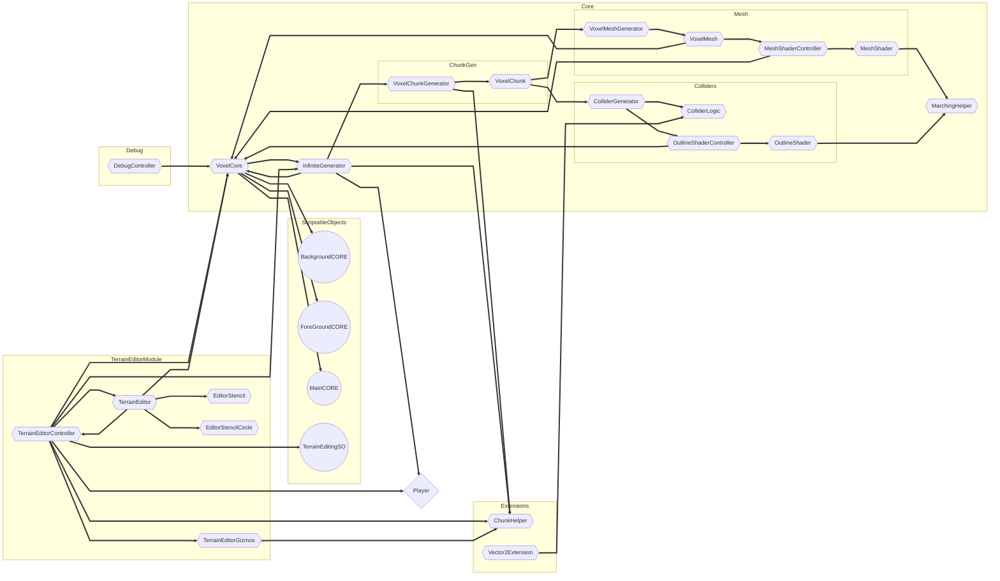

```mermaid
graph LR;
  %% Config
  linkStyle default interpolate linear;

  %% ScriptableObjects
  subgraph ScriptableObjects
    BackgroundCORE((BackgroundCORE));
    ForeGroundCORE((ForeGroundCORE));
    MainCORE((MainCORE));
    TerrainEditingSO((TerrainEditingSO));
  end

  %% Core Utilities
  subgraph Core
    VoxelCore{{VoxelCore}};
    InfiniteGenerator{{InfiniteGenerator}};

    subgraph ChunkGen
      VoxelChunkGenerator{{VoxelChunkGenerator}};
      VoxelChunk{{VoxelChunk}};
    end

    subgraph Colliders
      ColliderGenerator{{ColliderGenerator}};
      ColliderLogic{{ColliderLogic}};
      OutlineShaderController{{OutlineShaderController}};
      OutlineShader{{OutlineShader}};
    end

    subgraph Mesh
      VoxelMeshGenerator{{VoxelMeshGenerator}};
      VoxelMesh{{VoxelMesh}};
      MeshShaderController{{MeshShaderController}};
      MeshShader{{MeshShader}};
    end

    MarchingHelper{{MarchingHelper}};
  end

  %% Debug
  subgraph Debug
    DebugController{{DebugController}};
  end

  %% Extensions
  subgraph Extensions
    ChunkHelper{{ChunkHelper}};
    Vector2Extension{{Vector2Extension}};
  end

  %% Terrain Editor
  subgraph TerrainEditorModule
    TerrainEditorController{{TerrainEditorController}};
    TerrainEditorGizmos{{TerrainEditorGizmos}};
    TerrainEditor{{TerrainEditor}};
    EditorStencil{{EditorStencil}};
    EditorStencilCircle{{EditorStencilCircle}};
  end

  Player{Player};

  %% Core Connections
  VoxelCore ==> BackgroundCORE;
  VoxelCore ==> ForeGroundCORE;
  VoxelCore ==> MainCORE;
  VoxelCore ==> InfiniteGenerator;

  InfiniteGenerator ==> VoxelCore;
  InfiniteGenerator ==> VoxelChunkGenerator;
  InfiniteGenerator ==> Player;
  InfiniteGenerator ==> ChunkHelper;

  VoxelChunkGenerator ==> VoxelChunk;
  VoxelChunkGenerator ==> ChunkHelper;

  VoxelChunk ==> ColliderGenerator;
  VoxelChunk ==> VoxelMeshGenerator;

  ColliderGenerator ==> ColliderLogic;
  ColliderGenerator ==> OutlineShaderController;

  VoxelMeshGenerator ==> VoxelMesh;

  VoxelMesh ==> VoxelCore;
  VoxelMesh ==> MeshShaderController;

  MeshShaderController ==> VoxelCore;
  MeshShaderController ==> MeshShader;

  OutlineShaderController ==> VoxelCore;
  OutlineShaderController ==> OutlineShader;

  MeshShader ==> MarchingHelper;
  OutlineShader ==> MarchingHelper;

  Vector2Extension ==> ColliderLogic;

  DebugController ==> VoxelCore;

  TerrainEditorController ==> VoxelCore;
  TerrainEditorController ==> TerrainEditingSO;
  TerrainEditorController ==> InfiniteGenerator;
  TerrainEditorController ==> Player;
  TerrainEditorController ==> TerrainEditorGizmos;
  TerrainEditorController ==> ChunkHelper;
  TerrainEditorController ==> TerrainEditor;

  TerrainEditorGizmos ==> ChunkHelper;

  TerrainEditor ==> VoxelCore;
  TerrainEditor ==> TerrainEditorController;
  TerrainEditor ==> EditorStencil;
  TerrainEditor ==> EditorStencilCircle;
```
