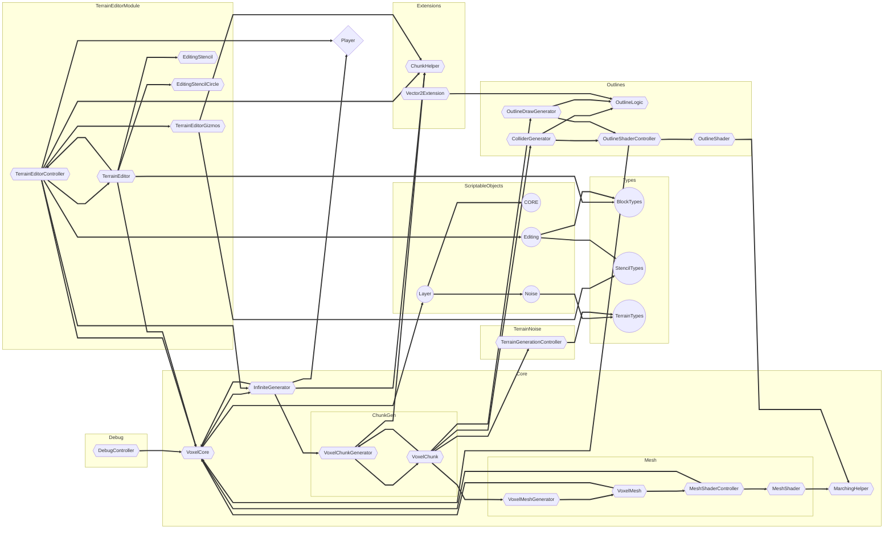

```mermaid
graph LR;
  %% Config
  linkStyle default interpolate linear;

  %% ScriptableObjects
  subgraph ScriptableObjects
    CORE((CORE));
    Layer((Layer));
    Noise((Noise));
    Editing((Editing));
  end

   %% Types
  subgraph Types
    BlockTypes((BlockTypes));
    StencilTypes((StencilTypes));
    TerrainTypes((TerrainTypes));
  end

  %% Core Utilities
  subgraph Core
    VoxelCore{{VoxelCore}};
    InfiniteGenerator{{InfiniteGenerator}};

    subgraph ChunkGen
      VoxelChunkGenerator{{VoxelChunkGenerator}};
      VoxelChunk{{VoxelChunk}};
    end

    subgraph Mesh
      VoxelMeshGenerator{{VoxelMeshGenerator}};
      VoxelMesh{{VoxelMesh}};
      MeshShaderController{{MeshShaderController}};
      MeshShader{{MeshShader}};
    end

    MarchingHelper{{MarchingHelper}};
  end

  %% Outlines
  subgraph Outlines
      ColliderGenerator{{ColliderGenerator}};
      OutlineDrawGenerator{{OutlineDrawGenerator}};
      OutlineLogic{{OutlineLogic}};
      OutlineShaderController{{OutlineShaderController}};
      OutlineShader{{OutlineShader}};
    end

  %% Debug
  subgraph Debug
    DebugController{{DebugController}};
  end

  %% Extensions
  subgraph Extensions
    ChunkHelper{{ChunkHelper}};
    Vector2Extension{{Vector2Extension}};
  end

  %% Terrain Editor
  subgraph TerrainEditorModule
    TerrainEditorController{{TerrainEditorController}};
    TerrainEditorGizmos{{TerrainEditorGizmos}};
    TerrainEditor{{TerrainEditor}};
    EditingStencil{{EditingStencil}};
    EditingStencilCircle{{EditingStencilCircle}};
  end

  %% Terrain Noise
  subgraph TerrainNoise
    TerrainGenerationController{{TerrainGenerationController}};
  end

  Player{Player};

  %% Core Connections
  Layer ==> CORE;

  Layer ==> Noise;

  Noise ==> TerrainTypes;

  VoxelCore ==> Layer;
  VoxelCore ==> InfiniteGenerator;

  InfiniteGenerator ==> VoxelCore;
  InfiniteGenerator ==> VoxelChunkGenerator;
  InfiniteGenerator ==> Player;
  InfiniteGenerator ==> ChunkHelper;

  VoxelChunkGenerator ==> VoxelChunk;
  VoxelChunkGenerator ==> ChunkHelper;

  VoxelChunk ==> ColliderGenerator;
  VoxelChunk ==> VoxelMeshGenerator;
  VoxelChunk ==> TerrainGenerationController;
  VoxelChunk ==> VoxelChunkGenerator;
  VoxelChunk ==> OutlineDrawGenerator;

  ColliderGenerator ==> OutlineLogic;
  ColliderGenerator ==> OutlineShaderController;

  OutlineDrawGenerator ==> OutlineLogic;
  OutlineDrawGenerator ==> OutlineShaderController;

  VoxelMeshGenerator ==> VoxelMesh;

  VoxelMesh ==> VoxelCore;
  VoxelMesh ==> MeshShaderController;

  MeshShaderController ==> VoxelCore;
  MeshShaderController ==> MeshShader;

  OutlineShaderController ==> VoxelCore;
  OutlineShaderController ==> OutlineShader;

  MeshShader ==> MarchingHelper;
  OutlineShader ==> MarchingHelper;

  Vector2Extension ==> OutlineLogic;

  DebugController ==> VoxelCore;

  TerrainEditorController ==> VoxelCore;
  TerrainEditorController ==> Editing;
  TerrainEditorController ==> InfiniteGenerator;
  TerrainEditorController ==> Player;
  TerrainEditorController ==> TerrainEditorGizmos;
  TerrainEditorController ==> ChunkHelper;
  TerrainEditorController ==> TerrainEditor;

  TerrainEditorGizmos ==> ChunkHelper;
  TerrainEditorGizmos ==> StencilTypes;

  TerrainEditor ==> VoxelCore;
  TerrainEditor ==> TerrainEditorController;
  TerrainEditor ==> EditingStencil;
  TerrainEditor ==> EditingStencilCircle;
  TerrainEditor ==> BlockTypes;

  TerrainGenerationController ==> TerrainTypes;

  Editing ==> BlockTypes;
  Editing ==> StencilTypes;
```
